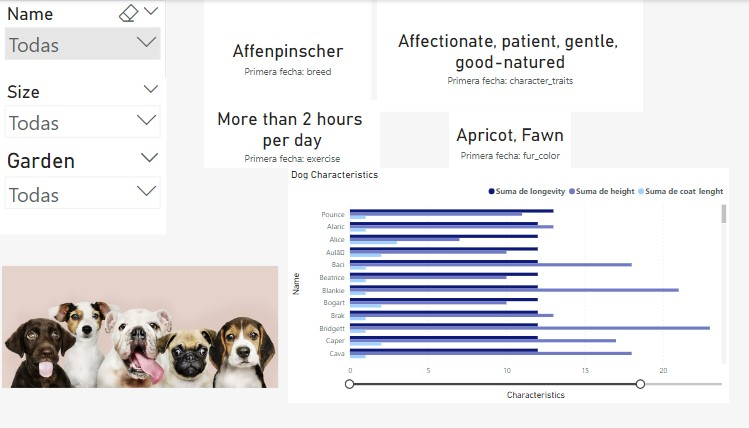

# Proyecto: Dashboard interactivo para adopción de perros

Este proyecto tiene como objetivo crear un dashboard interactivo para una protectora de animales que necesita encontrar hogares para 100 perros. Para ello, se han seguido los siguientes pasos:

## 1. ETL
La extracción de datos se ha realizado a través de Kaggle y web scraping. Se han obtenido datos sobre perros que contienen información como el nombre, la raza y otras características relevantes.

La transformación de datos se ha llevado a cabo con pandas de Python para conseguir un data frame de 100 filas con información sobre perros. Se han eliminado las columnas irrelevantes y se han rellenado los valores faltantes.

## 2. Definir objetivo (EDA)

Se ha realizado un análisis exploratorio de datos (EDA) para definir el objetivo del dashboard interactivo. Se ha evaluado la información disponible y se han identificado los criterios de selección más importantes para las personas que buscan adoptar un perro.

## 3. Dashboard en Power BI

Se ha creado un dashboard interactivo en Power BI que permite a las personas que buscan adoptar un perro elegir según sus necesidades. El dashboard incluye varios parámetros que se pueden ajustar para refinar la búsqueda. 
Se han incluido descripciones de cada perro para que las personas interesadas puedan conocer mejor a los perros disponibles

